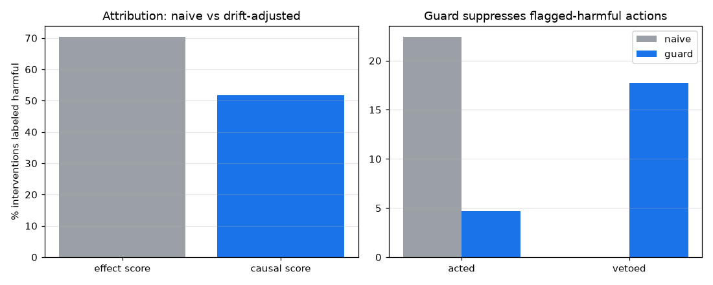

# 인과 평가·액션 가드 실험 (D11)

OHT 8대, 부하 λ=0.4, 큐 임계 5, 관제 주기 20, 시드 12개. 무개입 vs 순진 개입(가드 off) vs 인과 가드(가드 on). 개입 액션은 대기 최다 구역으로 유휴 차량 재배치.

## 1) 측정 교정 - 단순 효과 점수 vs 드리프트 보정 인과 점수 (순진 개입)

| 척도 | 평균 점수 | 악화로 분류된 개입 |
|---|---|---|
| 단순 효과(전-후) | -8.42 | 70% |
| 인과(반사실 보정) | -3.85 | 52% |

단순 전후 점수는 주변 큐 드리프트를 개입 탓으로 과대 귀속한다. 드리프트를 빼면 악화로 분류되는 개입 비율이 줄어, 개입이 보이는 것만큼 해롭지는 않음을 드러낸다.

## 2) 가드 동작 - 해로운 개입 거부

| 설정 | 평균 개입 | 평균 거부 |
|---|---|---|
| 순진(가드 off) | 22.4 | 0.0 |
| 인과 가드(가드 on) | 4.7 | 17.8 |

## 3) 운영 효과 (처리량, 쌍체 검정)

| 설정 | 처리량 | 평균 리드 | vs 무개입 |
|---|---|---|---|
| 무개입 | 0.2123 | 115.3 | - |
| 순진 개입 | 0.2138 | 113.5 | Δ=+0.00 [+0.00, +0.00], p=0.501 (유의하지 않음) |
| 인과 가드 | 0.2138 | 113.5 | Δ=+0.00 [+0.00, +0.00], p=0.501 (유의하지 않음) |

## 결정 (Decision)

인과 점수는 순진 효과 점수의 과대 귀속을 바로잡습니다(악화 분류 70% -> 52%, 평균 -8.4 -> -3.8). 가드는 인과적으로 해로운 개입을 거부해 개입을 22 -> 5회로 줄입니다. 처리량 차이는 순진 Δ=+0.00 [+0.00, +0.00], p=0.501 (유의하지 않음), 가드 Δ=+0.00 [+0.00, +0.00], p=0.501 (유의하지 않음)입니다.

해석: D5에서 관제 개입이 순손해로 보인 핵심 원인은 효과 점수가 주변 부하 변동을 개입 탓으로 돌린 데 있습니다. 반사실(개입 직전 추세) 보정으로 인과를 분리하면 개입의 해악이 과대평가였음이 드러나고, 가드는 그래도 인과 음수인 개입을 차단합니다. 다만 이 관제 액션(재배치·정책 전환)은 D7이 보였듯 처리량을 거의 못 움직이는 저레버리지라 운영 차이는 noise 범위입니다. 즉 가드의 가치는 처리량 회복이 아니라 해롭다고 인과 귀속된 개입의 낭비를 줄이는 데 있습니다. 같은 인과 점수·가드는 LLM 관제 경로에도 연결되어(reflection 프롬프트에 인과 점수 주입, action_guard로 해로운 액션 거부), 본 결정적 실험은 그 메커니즘을 키 없이 검증한 것입니다. 더 큰 레버리지(혼잡 라우팅 D10)와 결합하는 것이 다음 과제입니다.

