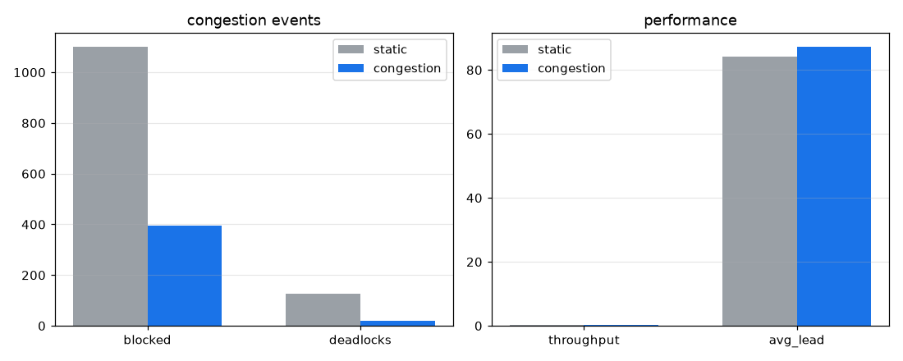

# 혼잡 인지 동적 라우팅 실험 (D10)

고밀도 시나리오(OHT 14대, 부하 λ=0.5), 시드 12개 쌍체. 정적 A* vs 혼잡 인지 라우팅(셀별 통행·회피 EMA를 비용에 가중). 평균은 95% 부트스트랩 CI, 차이는 쌍체 순열검정(양측) p값으로 판정.

## 지표별 비교 (Δ = 혼잡 - 정적)

| 지표 | 정적 [95% CI] | 혼잡 인지 [95% CI] | Δ 쌍체(p) |
|---|---|---|---|
| 처리량(↑) | 0.36 [0.34, 0.38] | 0.35 [0.34, 0.37] | Δ=-0.01 [-0.02, +0.01], p=0.445 (유의하지 않음) |
| 평균 리드(↓) | 84.21 [71.68, 96.50] | 87.25 [78.72, 95.95] | Δ=+3.04 [-7.31, +12.26], p=0.558 (유의하지 않음) |
| p95 리드(↓) | 140.74 [119.36, 161.54] | 146.00 [132.23, 160.05] | Δ=+5.26 [-11.76, +21.26], p=0.547 (유의하지 않음) |
| 회피 대기(↓) | 1101.00 [902.30, 1314.02] | 396.08 [363.08, 429.42] | Δ=-704.92 [-914.68, -509.49], p=0.000 (유의) |
| 교착(↓) | 126.50 [88.58, 166.25] | 19.67 [15.58, 23.75] | Δ=-106.83 [-146.17, -70.91], p=0.000 (유의) |

## 결정 (Decision)

혼잡 인지 라우팅이 회피 대기를 1101->396(-64%, 유의), 교착을 126->20(-84%, 유의)로 크게 줄입니다. 반면 처리량은 Δ=-0.01 [-0.02, +0.01], p=0.445 (유의하지 않음)로 유의한 변화가 없습니다.

해석: 정적 최단경로가 특정 셀을 과부하시켜 회피 대기·교착을 키우는 반면, 혼잡을 비용에 반영하면 트래픽이 분산되어 충돌 회피·교착이 통계적으로 유의하게(p<0.001) 크게 줄어듭니다. 다만 이 안정화가 처리량·리드타임 개선으로는 이어지지 않습니다. 혼잡을 피하느라 경로가 다소 길어져 평균·p95 리드는 소폭 늘지만 그 차이는 유의하지 않고, 처리량도 사실상 동률입니다. 즉 이 운영점에서 혼잡 라우팅의 이득은 처리량이 아니라 교착 같은 꼬리 위험을 84% 줄이는 운영 안정성에 있습니다(FAB에서 교착은 수동 개입이 필요한 중대 사건). D7이 배차 정책 차이를 유의하지 않다고 본 것과 달리, 병목인 혼잡을 직접 다루는 라우팅은 회피·교착에서 유의한 효과를 내며 FAB AMHS의 동적 링크 가중 제어(DLWC) 연구와 같은 방향입니다. 처리량까지 끌어올리려면 혼잡 가중과 경로 길이의 균형(alpha 튜닝)·고부하 스윕이 후속 과제입니다.

