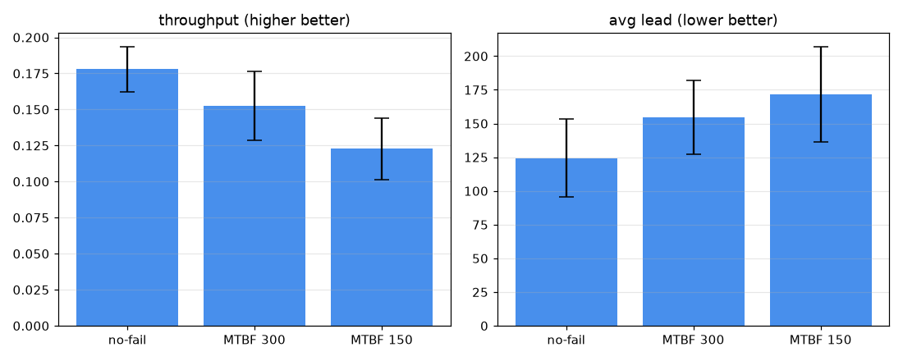

# 차량 고장이 반송 성능에 미치는 영향 (D8)

부하 λ=0.3, OHT 6대, 수리 시간 평균 40, 시드 10개 평균±표준편차. 고장 차량은 정지 장애물로 남고 미완 작업은 회수·재배차된다.

## 시나리오별 성능 (평균±표준편차)

| 시나리오 | 처리량 | 평균 리드 | 완료 작업 | 무고장 대비 처리량 |
|---|---|---|---|---|
| 무고장 | 0.178±0.016 | 124.4±28.8 | 106.7 | +0% |
| MTBF 300 | 0.152±0.024 | 154.6±27.3 | 91.4 | -14% |
| MTBF 150 | 0.123±0.021 | 171.7±35.3 | 73.7 | -31% |

## 결정 (Decision)

고장이 잦을수록(MTBF 감소) 처리량이 단조 감소하고 리드타임이 증가합니다. MTBF 150에서 처리량 -31%, 리드타임 +38%. 고장 차량이 트랙을 점유해 우회·재배차 비용이 더해지고, 가용 차량이 줄어 큐가 쌓입니다.

해석: 신뢰성은 처리량에 1차적으로 직접 영향을 줍니다. 이 시나리오는 가용성 저하가 성능에 미치는 크기를 보여 주며, 향후 L3 관제가 고장을 이상으로 감지해 유휴 차량 재배치·우선순위 조정으로 완화하는 폐루프의 평가 베드가 됩니다. 통계적 유의성이 필요하면 D7(stats.py)의 부트스트랩 CI·쌍체 검정을 그대로 적용할 수 있습니다.

