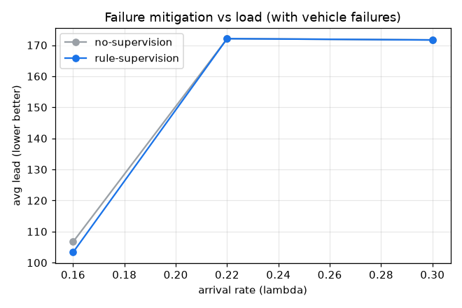

# 고장 인지 관제의 완화 효과 (D9)

OHT 6대, MTBF 150, 수리 40, 관제 주기 30, 시드 10개 평균. 규칙 관제는 가용 비율이 임계 미만이면(fleet_degraded) 부하 균형 + 대기 최다 구역 재배치로 완화한다.

## 부하별 리드타임 (낮을수록 좋음)

| 부하 λ | 무관제 리드 | 관제 리드 | Δ리드 | 관제 처리량 Δ | 평균 개입 |
|---|---|---|---|---|---|
| 0.16 | 106.7 | 103.3 | -3.1% | +2.4% | 8.3 |
| 0.22 | 172.1 | 172.1 | +0.0% | +0.0% | 7.8 |
| 0.30 | 171.7 | 171.7 | +0.0% | +0.0% | 7.3 |

## 결정 (Decision)

경부하(λ=0.16)에서 관제가 리드타임 -3.1%로 완화하지만, 고부하(λ=0.3)에서는 +0.0%로 효과가 사라집니다. 완화 여지는 배차 슬랙(유휴 차량)에 비례합니다.

해석: 관제는 잃은 가용 용량을 되돌릴 수 없습니다. 유휴 슬랙이 있는 경부하에서는 남은 차량을 부하 균형·수요 구역으로 돌려 리드타임을 줄이지만, 용량이 포화된 고부하에서는 어떤 정책이든 같은 배정이 되어 개입이 발동해도 효과가 0에 수렴합니다. 즉 용량 부족은 관제로 메울 수 없고, 관제의 가치는 슬랙의 운용 효율에 있습니다. 핵심 성과는 L1 고장이 L3 관찰(스냅샷 가용·고장)→감지(fleet_degraded)→개입(액션 API)으로 닫힌 루프에 연결되었다는 점이며, 통계적 유의성은 D7(stats.py)의 쌍체 검정을 그대로 적용할 수 있습니다.

