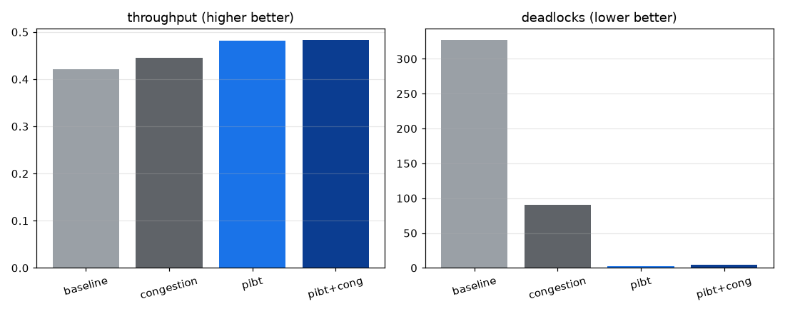

# L2 개선 결합 실험 - 혼잡 라우팅 + PIBT (D15)

고밀도(OHT 20대, λ=0.5), 시드 12개 쌍체. baseline·혼잡 라우팅(D10)·PIBT(D12)·둘 결합을 비교한다. PIBT 후보 선택에 혼잡을 동점 기준으로 결합했다.

## 설정별 평균

| 설정 | 처리량 | 회피 대기 | 교착 |
|---|---|---|---|
| baseline | 0.420 | 2551 | 327.2 |
| congestion | 0.446 | 1016 | 90.8 |
| pibt | 0.481 | 340 | 2.2 |
| pibt+cong | 0.483 | 307 | 4.1 |

## 핵심 검정 - 스택이 PIBT에 더하는 효과 (pibt+cong vs pibt)

- 처리량: Δ=+0.00 [-0.00, +0.01], p=0.314 (유의하지 않음)
- 회피 대기: Δ=-32.75 [-69.45, -0.25], p=0.102 (유의하지 않음)

## 결정 (Decision)

PIBT 없이 혼잡 라우팅은 baseline 대비 큰 이득을 내지만(처리량 0.420→0.446, 교착 327→91), PIBT 위에 혼잡 라우팅을 더해도 처리량은 Δ=+0.00 [-0.00, +0.01], p=0.314 (유의하지 않음)로 유의한 추가 이득이 없습니다. 회피 대기만 Δ=-32.75 [-69.45, -0.25], p=0.102 (유의하지 않음) 정도 더 줄어듭니다.

해석: 두 L2 개선은 보완재가 아니라 대체재입니다. PIBT가 우선순위 상속·백트래킹으로 혼잡·교착을 구조적으로 푸는 강한 메커니즘이라, 혼잡을 비용에 반영하는 라우팅이 줄 여지를 대부분 포섭합니다. 따라서 PIBT를 쓰면 혼잡 라우팅은 거의 불필요하고, 반대로 PIBT를 못 쓰는 환경(예: 외부 경로계획 고정)에서는 혼잡 라우팅이 값싼 대안이 됩니다. 결합의 한계 이득(회피 대기 소폭 감소)은 동점 기준 수준에 그칩니다.

