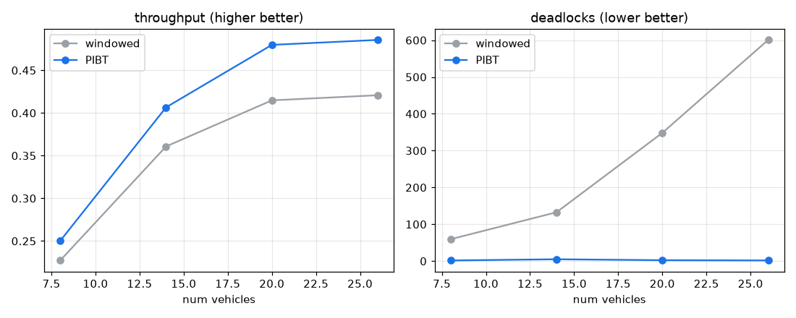

# PIBT vs 임시 우선순위 플래너 (D12)

부하 λ=0.5, 차량 수 스윕 [8, 14, 20, 26], 시드 10개 쌍체. 기존 임시 플래너 vs PIBT(우선순위 상속 + 백트래킹). 처리량·교착·회피 대기를 측정하고 차이를 쌍체 순열검정(양측)으로 판정한다.

## 차량 수별 비교 (Δ = PIBT - windowed)

| 차량 | 처리량 windowed→PIBT (Δ, p) | 교착 windowed→PIBT (Δ%) | 회피 windowed→PIBT (Δ%) |
|---|---|---|---|
| 8 | 0.227→0.250 (+0.023, p=0.005*) | 59→2 (-97%) | 457→88 (-81%) |
| 14 | 0.361→0.407 (+0.046, p=0.008*) | 133→5 (-96%) | 1144→268 (-77%) |
| 20 | 0.415→0.480 (+0.065, p=0.002*) | 348→2 (-99%) | 2652→343 (-87%) |
| 26 | 0.421→0.486 (+0.065, p=0.002*) | 601→2 (-100%) | 4280→314 (-93%) |

(* 처리량 차이 p<0.05)

## 결정 (Decision)

PIBT가 모든 밀집도에서 교착을 거의 제거하고(최대 차량 26대서 교착 -100%), 처리량을 높입니다(차량 26대서 +15%). 이득은 차량이 많아질수록 커집니다.

해석: 기존 임시 플래너는 진전 불가 시 대기하고 일부만 회복해, 밀집도가 오르면 교착이 급증하며 차량이 서로를 막아 처리량이 정체됩니다. PIBT는 고우선 차량이 저우선 차량을 우선순위 상속으로 비켜세우고 백트래킹으로 막다른 배치를 회피해, 정점·스왑 충돌 없이 교착을 구조적으로 푼다. 그 결과 교착이 거의 사라지고 밀집 구간의 처리량이 회복됩니다. 혼잡 라우팅(D10)이 회피·교착을 줄이되 처리량은 동률이던 것과 달리, PIBT는 교착 해소가 직접 처리량 이득으로 이어집니다. 수백 대까지의 확장은 PIBT의 알려진 강점이며 본 실험은 그 추세를 재현합니다(Okumura et al. 2019).

