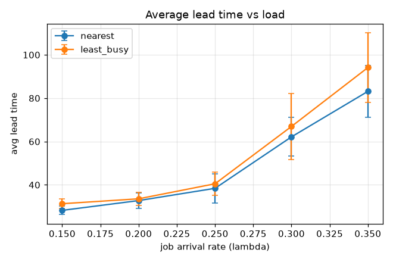
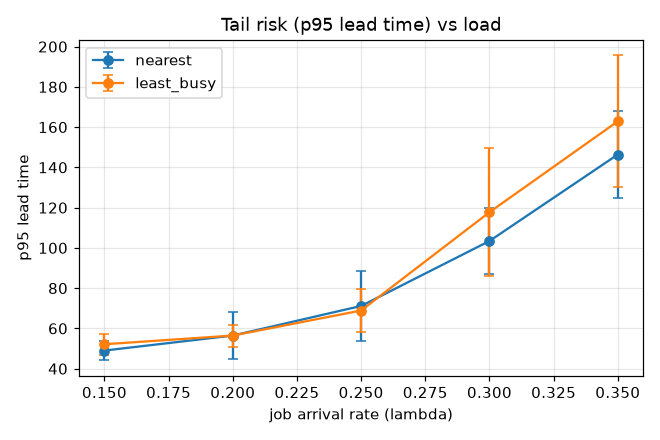
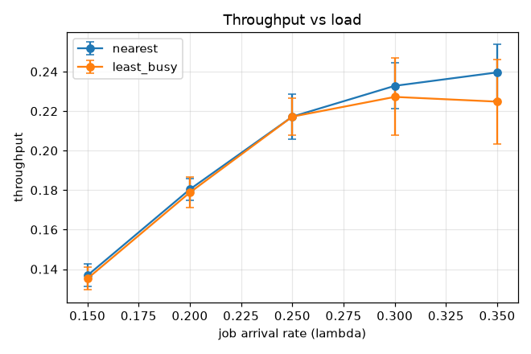

# 정책 비교 실험 (D1) - 배차 정책

설정: OHT 8대, 격자 20x20, 충돌·교착 회피(L2) 적용, 시뮬레이션 500, 시드 [1, 2, 3, 4, 5](n=5).
값은 시드 간 평균(괄호는 표준편차).

## 평균 리드타임

| λ | nearest | least_busy | 우세 |
|---|---|---|---|
| 0.15 | 28.25 (1.95) | 31.32 (2.17) | nearest |
| 0.20 | 32.76 (3.64) | 33.58 (3.10) | nearest |
| 0.25 | 38.42 (6.75) | 40.52 (5.36) | nearest |
| 0.30 | 62.14 (8.90) | 66.95 (15.25) | nearest |
| 0.35 | 83.14 (11.84) | 94.12 (16.00) | nearest |

## p95 리드타임 (꼬리 위험)

| λ | nearest | least_busy | 우세 |
|---|---|---|---|
| 0.15 | 49.01 (4.89) | 52.15 (5.27) | nearest |
| 0.20 | 56.46 (11.85) | 56.46 (5.49) | least_busy |
| 0.25 | 71.16 (17.29) | 68.90 (10.78) | least_busy |
| 0.30 | 103.43 (16.27) | 117.73 (31.79) | nearest |
| 0.35 | 146.39 (21.66) | 162.89 (32.81) | nearest |

## 처리량

| λ | nearest | least_busy | 우세 |
|---|---|---|---|
| 0.15 | 0.14 (0.01) | 0.14 (0.01) | nearest |
| 0.20 | 0.18 (0.01) | 0.18 (0.01) | nearest |
| 0.25 | 0.22 (0.01) | 0.22 (0.01) | = |
| 0.30 | 0.23 (0.01) | 0.23 (0.02) | nearest |
| 0.35 | 0.24 (0.01) | 0.22 (0.02) | nearest |

## 최대 큐

| λ | nearest | least_busy | 우세 |
|---|---|---|---|
| 0.15 | 1.40 (0.80) | 1.20 (1.17) | least_busy |
| 0.20 | 4.60 (1.62) | 4.60 (1.62) | = |
| 0.25 | 11.20 (6.73) | 10.40 (5.64) | least_busy |
| 0.30 | 25.00 (4.86) | 28.40 (10.59) | nearest |
| 0.35 | 44.80 (9.24) | 52.00 (14.56) | nearest |

## 교착 감지수

| λ | nearest | least_busy | 우세 |
|---|---|---|---|
| 0.15 | 33.40 (10.29) | 41.40 (19.00) | nearest |
| 0.20 | 49.00 (27.44) | 43.40 (11.55) | least_busy |
| 0.25 | 37.40 (24.91) | 27.80 (22.83) | least_busy |
| 0.30 | 31.40 (18.42) | 51.80 (28.53) | nearest |
| 0.35 | 36.20 (22.43) | 56.80 (53.76) | nearest |

## 결정 (Decision)

평균 리드타임 기준 5개 부하 중 nearest 5회 / least_busy 0회 우세. 종합 우세 정책: **nearest**.

트레이드오프: least_busy는 부하 균형으로 특정 차량 쏠림을 줄이나, 유휴 차량이 드문 고부하 영역에서는 선택 여지가 적어 효과가 줄어듭니다. nearest는 저부하에서 이동 거리를 줄여 유리할 수 있습니다. 꼬리 위험(p95)은 위 표로 비교합니다.

