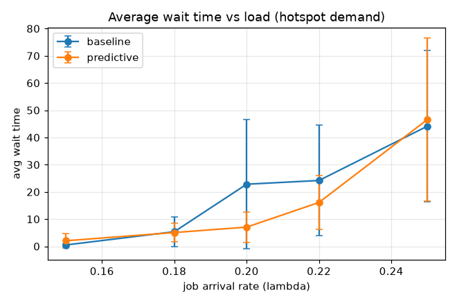
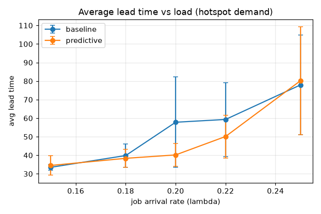

# 예측 기반 사전 배차 실험 (D2)

설정: OHT 8대, 격자 20x20, 충돌·교착 회피(L2), 시간 변동 핫스팟 수요(구역 2x2, 주기 300, 가중 0.75), 시뮬레이션 800, 시드 [1, 2, 3, 4, 5](n=5).
값은 시드 간 평균(괄호는 표준편차).

## 평균 대기시간

| λ | baseline | predictive | 개선 |
|---|---|---|---|
| 0.15 | 0.50 (0.27) | 2.05 (2.69) | -306% |
| 0.18 | 5.37 (5.44) | 5.07 (3.38) | +5% |
| 0.20 | 22.82 (23.80) | 7.06 (5.61) | +69% |
| 0.22 | 24.19 (20.32) | 16.12 (9.99) | +33% |
| 0.25 | 44.16 (27.71) | 46.62 (29.86) | -6% |

## 평균 리드타임

| λ | baseline | predictive | 개선 |
|---|---|---|---|
| 0.15 | 33.50 (1.58) | 34.49 (5.29) | -3% |
| 0.18 | 39.84 (6.35) | 38.34 (4.92) | +4% |
| 0.20 | 57.80 (24.37) | 40.18 (6.20) | +30% |
| 0.22 | 59.31 (19.95) | 50.12 (11.53) | +15% |
| 0.25 | 77.93 (26.91) | 80.19 (29.04) | -3% |

## p95 리드타임 (꼬리 위험)

| λ | baseline | predictive | 개선 |
|---|---|---|---|
| 0.15 | 52.96 (4.19) | 62.66 (16.74) | -18% |
| 0.18 | 68.70 (14.12) | 66.95 (13.61) | +3% |
| 0.20 | 116.14 (60.09) | 68.55 (11.43) | +41% |
| 0.22 | 116.95 (64.60) | 85.26 (19.70) | +27% |
| 0.25 | 130.09 (48.99) | 136.24 (48.91) | -5% |

## 결정 (Decision)

예측 사전 배차는 중부하(슬랙이 있는 혼잡) 영역에서 가장 큰 이득을 보입니다. 최대 개선 부하 λ=0.20에서 평균 대기 +69%.

트레이드오프: 저부하에서는 이미 대기가 짧아 선제 이동 비용이 더 크고, 고부하에서는 유휴 슬랙이 없어 재배치 여지가 적습니다. 예측은 단순 EMA로, 핫스팟 주기가 길수록(수요가 지속될수록) 예측 정확도와 이득이 커집니다.

