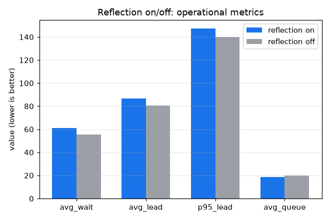
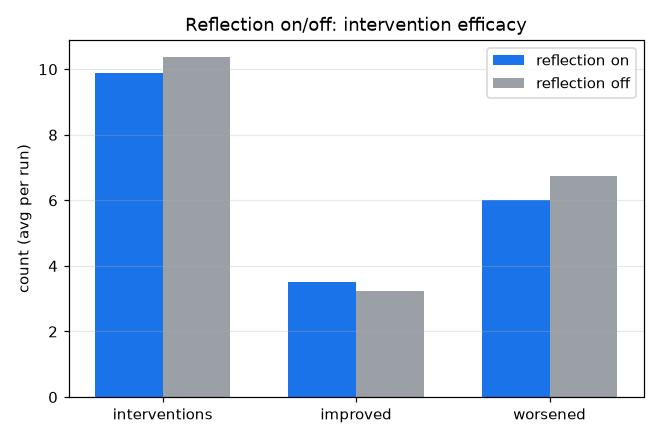

# 개입 효과 평가·reflection 닫힌 루프 실험 (D5)

L3 관제를 reflection on/off로 비교. 모델 gpt-4o-mini, 부하 λ=0.3, OHT 6대, 관제 주기 30, 큐 임계 8, 평가 시드 [1, 2, 3, 4, 5, 6, 7, 8].

## 운영 지표 (시드 평균, 낮을수록 좋음)

| 지표 | reflection on | reflection off | 차이 |
|---|---|---|---|
| 평균 대기 | 61.06 | 55.37 | +10% |
| 평균 리드 | 86.48 | 80.74 | +7% |
| p95 리드 | 147.36 | 140.04 | +5% |
| 평균 큐 | 18.73 | 20.04 | -6% |

## 개입 효율 (시드 평균)

| 지표 | reflection on | reflection off |
|---|---|---|
| 개입 수 | 9.9 | 10.4 |
| 개선 | 3.5 | 3.2 |
| 악화 | 6.0 | 6.8 |
| 평균 효과 점수 | -3.10 | -8.11 |

## 결정 (Decision)

reflection on의 평균 효과 점수 -3.10, off -8.11로, 효과 이력을 프롬프트에 주입하면 개입의 자기측정 효율이 개선됩니다(악화 개입 6.8->6.0, 개선 3.2->3.5). 다만 운영 지표로는 이어지지 않아 평균 대기는 61.1 vs 55.4(+10%)로 오히려 소폭 나빠집니다.

해석: 두 설정 모두 평균 효과 점수가 음수라는 점이 핵심입니다. LLM 관제의 개입이 평균적으로는 지표를 악화시키는 경향이 있고, reflection은 그 손해를 줄일 뿐 순이득으로 뒤집지는 못합니다. 또한 효과 점수는 개입 전후 델타라 주변 부하 변동과 개입 효과가 섞여 인과를 단정하기 어렵습니다. 8시드 고분산이라 통계적 유의성은 D7(stats.py)의 쌍체 검정으로 확인해야 하며, 현 결과는 reflection이 자기측정 효율은 높이되 운영 개선과 인과 귀속은 추가 작업이 필요함을 시사합니다.

