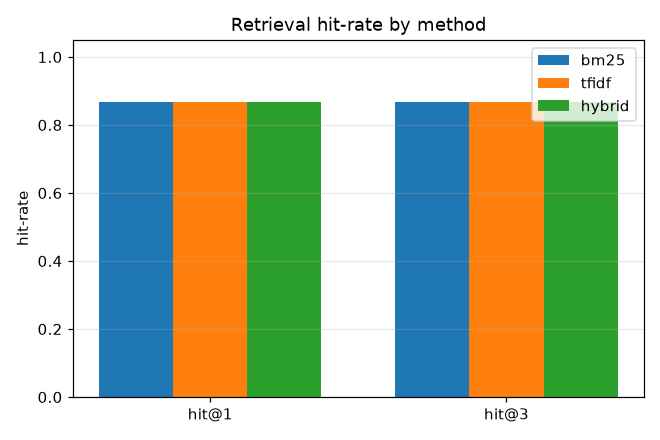

# 검색 정확도 비교 실험 (D3) - 하이브리드 RAG

라벨 질의 15개, 코퍼스 8개(사례·규칙). BM25(어휘) / TF-IDF(벡터) / 하이브리드(RRF) 비교.

| method | hit@1 | hit@3 |
|---|---|---|
| bm25 | 0.87 | 0.87 |
| tfidf | 0.87 | 0.87 |
| hybrid | 0.87 | 0.87 |

## 결정 (Decision)

hit@3 최고: 동률(bm25, tfidf, hybrid), hit-rate 0.87. 본 코퍼스에서는 BM25·TF-IDF·하이브리드가 사실상 동일합니다. 두 리트리버 모두 어휘 기반이라 랭킹이 유사하고, RRF 융합도 같은 신호를 결합하므로 단일 리트리버 대비 순이득이 없습니다.

한계·확장: 남는 실패는 본문과 어휘 중복이 없는 동의어·패러프레이즈 질의로, 시맨틱 임베딩 리트리버를 RRF에 드롭인으로 추가해야 잡힙니다(후속). 즉 진짜 하이브리드 이득은 어휘+시맨틱 조합에서 나오며, 본 실험은 그 전제와 한계를 정량으로 보여줍니다.

