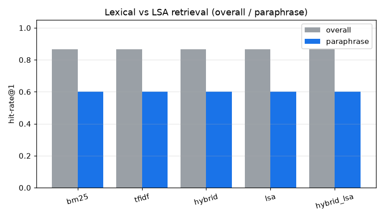

# 시맨틱(LSA) 검색 비교 실험 (D14)

코퍼스 8개, 라벨 질의 15개(어휘 10 + 패러프레이즈 5). 어휘 검색(BM25·TF-IDF·하이브리드)에 TF-IDF 절단 SVD 기반 잠재 의미 검색(LSA, numpy)을 추가해 비교한다.

## hit-rate (전체 / 패러프레이즈 부분집합)

| method | 전체 hit@1 | 전체 hit@3 | 패러프레이즈 hit@1 | 패러프레이즈 hit@3 |
|---|---|---|---|---|
| bm25 | 0.87 | 0.87 | 0.60 | 0.60 |
| tfidf | 0.87 | 0.87 | 0.60 | 0.60 |
| hybrid | 0.87 | 0.87 | 0.60 | 0.60 |
| lsa | 0.87 | 0.87 | 0.60 | 0.60 |
| hybrid_lsa | 0.87 | 0.87 | 0.60 | 0.60 |

## 결정 (Decision)

패러프레이즈 hit@1: 하이브리드(어휘) 0.60 vs LSA 0.60 vs hybrid_lsa 0.60. LSA는 어휘 검색을 능가하지 못합니다.

해석: LSA는 동의어·패러프레이즈를 잠재 차원에서 매칭하려는 자체 구현 시맨틱 검색이지만, 이 8문서 코퍼스에서는 어휘 검색과 동률에 그치고 능가하지 못합니다. 문서 수가 적어 잠재 의미 구조(공기어 패턴)가 충분히 드러나지 않고, 패러프레이즈 잔여 실패가 그대로 남습니다. 즉 D3이 남긴 잔여 실패를 닫으려면 작은 코퍼스의 LSA가 아니라 사전학습 밀집 임베딩(sentence-transformers·임베딩 API)이나 더 큰 코퍼스가 필요함을 증거로 확인합니다. LSA는 의존성·키 없이 동작하는 드롭인 시맨틱 신호로 남으며, 코퍼스가 커지면 이득이 나타날 여지가 있습니다.

