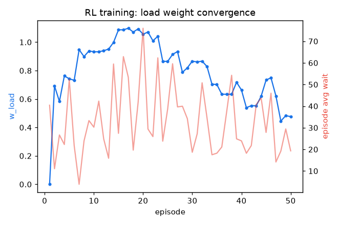
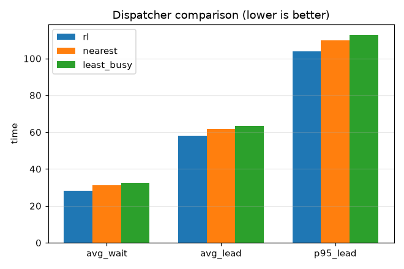

# 강화학습 배차 실험 (D4)

선형 정책 + REINFORCE(부하 가중 w_load만 학습, 거리 가중 1 고정). 부하 λ=0.28, OHT 8대, 학습 50 에피소드, 평가 시드 [1, 2, 3, 4, 5, 6, 7, 8, 9, 10, 11, 12, 13, 14, 15].

학습 결과: w_load 0.00 -> 0.48 로 수렴(부하 균형 가중 학습).

## 성능 비교 (평가 시드 평균, 낮을수록 좋음)

| method | 평균 대기 | 평균 리드 | p95 리드 |
|---|---|---|---|
| rl | 28.18 | 58.05 | 104.01 |
| nearest | 31.28 | 61.58 | 109.85 |
| least_busy | 32.67 | 63.34 | 112.82 |

## 결정 (Decision)

부하 가중을 0 -> 0.48로 학습해 nearest(거리만)와 least_busy(부하만) 사이의 거동을 익혔습니다. 평균 대기 RL 28.2 vs nearest 31.3 vs least_busy 32.7. 학습 디스패처가 평균 대기 최저(28.2), nearest 대비 +10%.

해석: 학습된 중간 부하 가중이 거리 기반 선택에 약한 부하 균형을 섞어 본 부하 영역에서 소폭 개선을 냈습니다. 다만 시드 간 분산이 커(표준편차가 평균에 근접) 이득은 통계적으로 견고하지 않으며 부하 영역에 의존합니다. 픽업 대기 보상이 이동 거리에 지배되어 개선 폭은 제한적입니다. 부하 균형의 큰 이득은 향후 작업까지 걸친 지연(다중 에이전트 신용 할당) 효과이므로, 리드타임 기반 보상·부트스트래핑(Q학습)·풍부한 상태로 확장해야 더 커집니다. 설계서의 입장(휴리스틱이 강한 베이스라인, 강화학습은 비교 대상)과 부합합니다.

