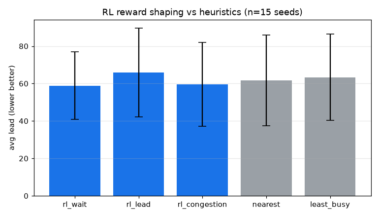

# RL 배차 보상 재설계 실험 (D13)

동일 MLP 정책을 세 보상(대기·리드·혼잡 페널티)으로 학습. 부하 λ=0.28, OHT 8대, 학습 50 에피소드, 평가 시드 [1, 2, 3, 4, 5, 6, 7, 8, 9, 10, 11, 12, 13, 14, 15]. 평균 리드·처리량을 보고하고 nearest 대비 쌍체 순열검정으로 판정한다.

## 성능 비교 (평가 시드 평균)

| method | 평균 리드 | 평균 대기 | 처리량 | nearest 대비 리드 Δ(p) |
|---|---|---|---|---|
| rl_wait | 58.9 | 29.2 | 0.217 | -2.7 (p=0.574) |
| rl_lead | 65.9 | 35.0 | 0.201 | +4.3 (p=0.076) |
| rl_congestion | 59.6 | 29.6 | 0.212 | -2.0 (p=0.603) |
| nearest | 61.6 | 31.3 | 0.205 | - (기준) |
| least_busy | 63.3 | 32.7 | 0.205 | +1.8 (p=0.256) |

(* nearest 대비 p<0.05)

## 결정 (Decision)

보상별 학습 정책 중 평균 리드 최저는 rl_wait (58.9) vs nearest (61.6). RL이 nearest를 유의하게 이기는 보상은 없습니다(전부 p>0.05).

해석: D6은 RL이 거리 휴리스틱을 못 이긴 원인을 보상 설계로 추정했습니다. D13은 이를 검증했고, 결과는 그 가설을 뒷받침하지 않습니다. 리드타임 보상은 오히려 가장 나빴고(리드가 다스텝 다운스트림 효과를 담아 단일 배차에 신용 할당이 어려운 탓), 혼잡 보상도 기존 대기 보상과 사실상 동률이며, 어느 것도 nearest를 유의하게 이기지 못합니다. 즉 이 부하·레이아웃에서 병목은 보상이 아니라 배차 자체의 낮은 레버리지(D7이 보인 '배차 차이 비유의')입니다. 더 큰 이득은 배차 보상 손질이 아니라 혼잡 라우팅(D10)·PIBT(D12)처럼 병목인 이동·혼잡을 직접 다루는 데서 나옵니다. 부트스트래핑(Q학습)·다스텝 신용 할당은 여전히 열린 확장이지만, 본 결과는 그 이전에 배차 레버리지의 한계를 시사합니다.

