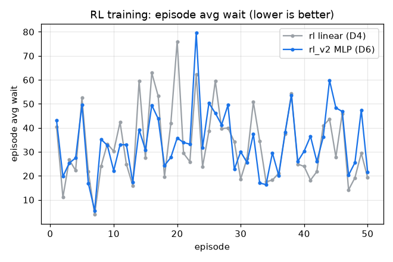
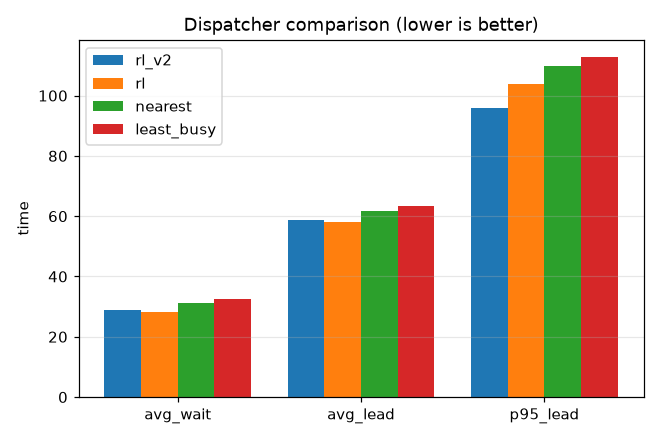

# 강화 RL 배차 실험 (D6)

D4 선형 정책(상태 3차원·부하 가중만 학습)을 풍부한 상태 6차원 + 비선형 MLP(은닉 1층, tanh, 전 파라미터 학습)로 확장. 부하 λ=0.28, OHT 8대, 학습 50 에피소드, 평가 시드 [1, 2, 3, 4, 5, 6, 7, 8, 9, 10, 11, 12, 13, 14, 15]. 보상은 D4와 동일(음의 평균 대기).

학습 결과: 에피소드 평균 대기 MLP 43.0 -> 21.6, 선형 40.4 -> 19.3.

## 성능 비교 (평가 시드 평균, 낮을수록 좋음)

| method | 평균 대기 | 표준편차 | 평균 리드 | p95 리드 |
|---|---|---|---|---|
| rl_v2 | 28.83 | 17.45 | 58.77 | 96.02 |
| rl | 28.18 | 15.85 | 58.05 | 104.01 |
| nearest | 31.28 | 20.85 | 61.58 | 109.85 |
| least_busy | 32.67 | 19.95 | 63.34 | 112.82 |

## 결정 (Decision)

평균 대기 rl_v2(MLP) 28.8 vs rl(선형) 28.2 vs nearest 31.3. 두 학습 정책 모두 nearest 대비 약 8% 앞서지만, 비선형·풍부한 상태(rl_v2)는 선형(rl)을 이기지 못하고 평균에서 근소하게 뒤집니다(최저 rl 28.2). 다만 rl_v2의 p95 리드는 96로 rl 104보다 꼬리가 짧고, 대신 시드 간 표준편차는 17.4로 rl 15.8보다 큽니다.

해석: 정책 용량을 키워도(은닉층·6차원 상태) 평균 대기 이득이 없다는 것은 병목이 정책 표현력이 아니라 보상 설계임을 재확인합니다. 보상을 D4와 동일한 음의 평균 대기로 두면 픽업 대기가 이동 거리에 지배되어 거리 휴리스틱이 이미 강한 베이스라인이 됩니다. 비선형 정책의 기여는 평균이 아니라 꼬리(p95) 완화에서 제한적으로 나타났습니다. 더 큰 이득은 리드타임·혼잡 기반 보상과 부트스트래핑(Q학습)으로 보상 신호를 바꿔야 열리며, 이는 후속 과제로 둡니다. 설계서 입장(휴리스틱은 강한 베이스라인, 강화학습은 비교 대상)과 부합합니다.

