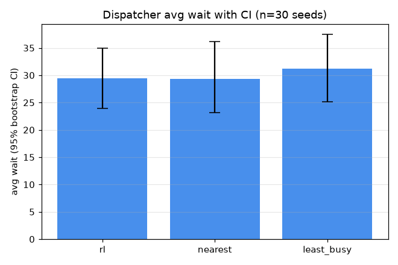

# 배차 비교의 통계적 유의성 실험 (D7)

부하 λ=0.28, OHT 8대, 시드 30개 쌍체 측정. 평균은 95% 부트스트랩 신뢰구간, 방법 간 차이는 부호뒤집기 순열검정(양측, n_perm=10000) p값으로 판정한다.

## 평균 대기 ± 95% 신뢰구간 (낮을수록 좋음)

| method | 평균 [95% CI] |
|---|---|
| rl | 29.48 [23.98, 34.95] |
| nearest | 29.38 [23.11, 36.14] |
| least_busy | 31.17 [25.13, 37.50] |

## 쌍체 유의성 검정 (Δ = 좌 - 우, 음수면 좌가 더 빠름)

| 비교 | 결과 |
|---|---|
| rl vs nearest | Δ=+0.09 [-3.91, +3.99], p=0.963 (유의하지 않음) |
| nearest vs least_busy | Δ=-1.79 [-3.93, +0.42], p=0.143 (유의하지 않음) |
| rl vs least_busy | Δ=-1.69 [-5.32, +1.92], p=0.364 (유의하지 않음) |

## 결정 (Decision)

유의(p<0.05): 없음. 유의하지 않음: rl vs nearest, nearest vs least_busy, rl vs least_busy.

해석: 이 부하(λ=0.28)·시드 30개에서 세 방법의 평균 대기 신뢰구간이 서로 크게 겹치고 모든 쌍체 차이가 유의하지 않습니다. 즉 D4가 15시드 점추정으로 보고한 'RL이 nearest보다 약 10% 빠름'은 시드 노이즈 범위 안의 변동이며, 시드를 늘리면 차이가 사라집니다(rl vs nearest Δ≈0, p≈0.96). 배차 정책 선택보다 시드 간 분산이 성능을 더 크게 좌우하는 영역임을 뜻합니다. 단 단일 부하의 결과이므로 고부하·혼잡 영역에서는 차이가 유의해질 수 있어 부하 스윕은 후속 과제로 둡니다. 이 프레임(stats.py)은 D1·D4·D6 등 다른 비교에도 그대로 적용해 '평균이 낮다'와 '유의하게 낫다'를 구분하는 표준 절차로 쓸 수 있습니다.

