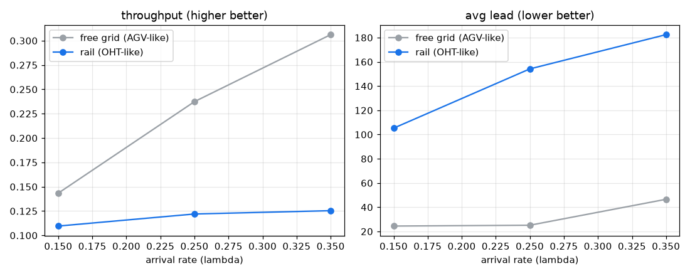

# 토폴로지 비교 - 자유 격자 vs 방향성 레일 (D16)

격자 14x10, Station 10, OHT 10대, 시드 10개 쌍체. 자유 격자(AGV/AMR식 4방향 자유 이동)와 방향성 레일(OHT 단방향 모노레일: 인터베이 루프 + 인트라베이 베이)을 부하별로 비교한다. 리드 차이는 쌍체 순열검정으로 판정한다.

## 부하별 비교 (Δ = rail - grid)

| 부하 λ | 처리량 grid→rail | 평균 리드 grid→rail (Δ, p) | 교착 grid→rail |
|---|---|---|---|
| 0.15 | 0.143→0.110 | 24.4→105.3 (+80.8, p=0.002*) | 75→47 |
| 0.25 | 0.237→0.122 | 25.1→154.2 (+129.0, p=0.002*) | 102→24 |
| 0.35 | 0.306→0.125 | 46.5→182.5 (+135.9, p=0.002*) | 154→19 |

(* 리드 차이 p<0.05)

## 결정 (Decision)

같은 작업 부하에서 레일 토폴로지는 리드타임을 약 4.3배로 늘리고 처리량을 -24%(λ=0.15) 떨어뜨립니다. 단방향 레일은 목적지가 진행 방향 뒤면 루프를 돌아야 해 이동 거리가 크게 늘기 때문입니다. 다만 정면 교착은 줄어듭니다(단방향).

해석: 자유 격자(AGV/AMR식)는 이동 비용을 크게 과소평가했고, 실제 OHT 모노레일의 단방향 제약이 성능을 지배함을 보여줍니다. 즉 기존 D1~D15의 절대 수치는 격자 가정에서 낙관적이며, OHT 충실도를 높이려면 토폴로지가 출발점입니다. 본 레일은 외곽 루프 + 베이 골격의 최소 구현이라 실제 fab보다 제약이 강합니다. 실 fab은 숏컷·복수 루프·양방향 인터베이로 이를 완화하므로, 다음 단계는 숏컷·정션 용량·로드포트 blocking을 더해 실제 AMHS에 다가가는 것입니다. 이 위에서 D10 혼잡 라우팅·D12 PIBT를 다시 평가하면 토폴로지 의존 효과가 드러날 것입니다.

